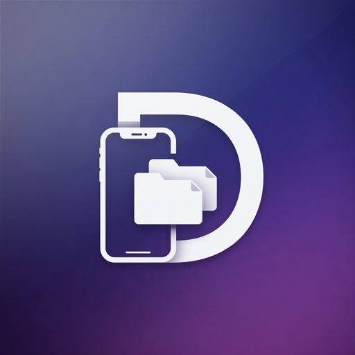
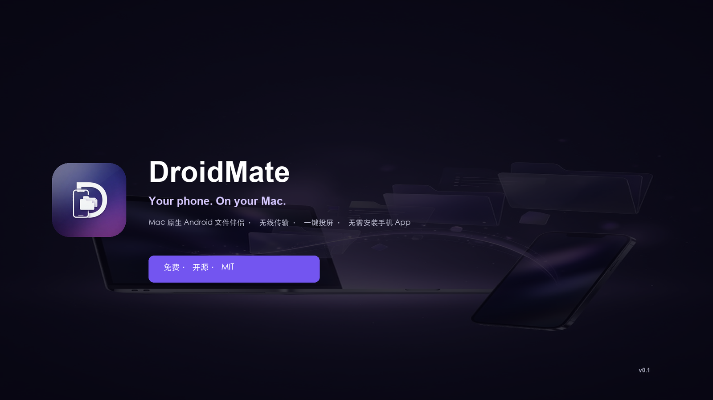
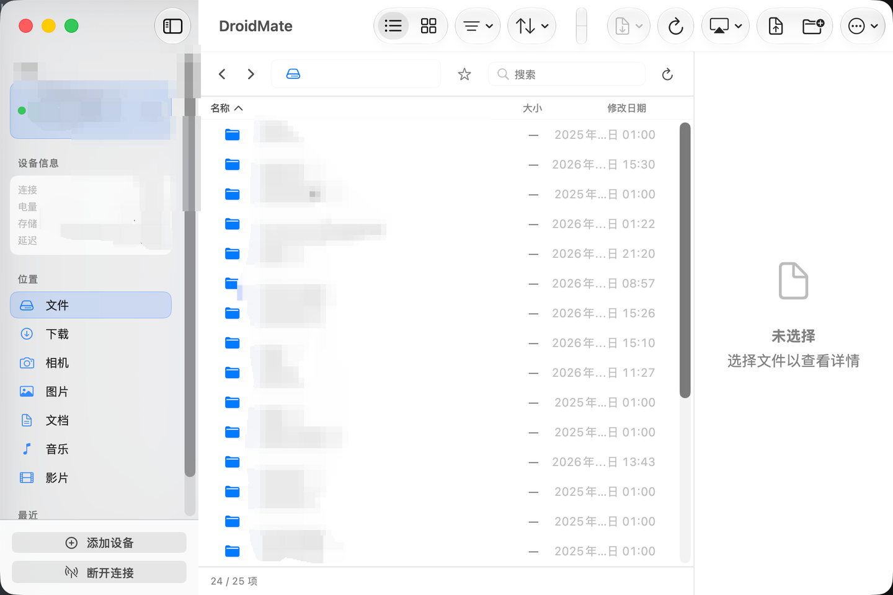

<p align="center">
  
</p>

<h1 align="center">DroidMate</h1>

<p align="center">
  <strong>Mac 上的 Android 文件管理 + 投屏</strong><br/>
  原生 SwiftUI · USB / Wi‑Fi · 手机不用装 App · MIT 开源
</p>

<p align="center">
  <a href="https://github.com/chengxuyuanluyu/DroidMate/releases/latest"></a>
  <a href="https://github.com/chengxuyuanluyu/DroidMate/releases"></a>
  
  
  
</p>

<p align="center">
  <a href="https://github.com/chengxuyuanluyu/DroidMate/releases/latest"><b>⬇ 下载最新版 DMG</b></a>
  ·
  <a href="#安装">安装说明</a>
  ·
  <a href="#功能">功能</a>
  ·
  <a href="#开发">开发</a>
</p>

<p align="center">
  
</p>

<p align="center">
  
</p>

---

## 为什么用 DroidMate

| | |
|---|---|
| **手机零安装** | 开启 USB 调试即可；服务端 jar 由 Mac 自动推送 |
| **文件 + 投屏一体** | Finder 风格浏览 / 传输，内置 scrcpy 镜像与控制 |
| **USB 与 Wi‑Fi** | 线连最稳；Android 11+ 无线调试可配对后无线用 |
| **本地直连** | 不经过云、不建账号，数据只在你的 Mac 和手机之间 |
| **开源可审计** | MIT，构建脚本与协议文档都在仓库里 |

---

## 功能

- **文件管理** — 列表 / 网格、多选、拖拽到 Finder、上传下载、冲突处理（替换 / 两份都保留）
- **投屏控制** — 捆绑 scrcpy，画质预设、录屏、导航键；可选 Wi‑Fi 软限速
- **剪贴板** — Mac ↔ 手机文本同步（可在设置开关）
- **通知** — 设备通知同步（Data Channel）
- **多设备** — 侧边栏切换会话；状态栏菜单快捷操作
- **MCP（可选）** — Agent 用 adb 工具链，见 [docs/MCP.md](docs/MCP.md)

---

## 安装

### 用户（推荐）

1. 打开 **[Releases](https://github.com/chengxuyuanluyu/DroidMate/releases/latest)**，下载 `DroidMate-x.y.z.dmg`
2. 将 **DroidMate** 拖进「应用程序」
3. **第一次启动**：在 App 上 **右键 → 打开**（ad-hoc / 未公证包需确认一次）
4. 手机开启 **开发者选项 → USB 调试**，用数据线连接；或按应用内引导做 **无线调试** 配对

> 投屏用的 scrcpy 与 adb **已打进安装包**，一般不必再单独装 Homebrew 版。

### 系统要求

- **Mac**：Apple Silicon，macOS 15+
- **手机**：USB 调试；无线需 Android 11+ 无线调试

---

## 架构（简）

```
┌───────────── Mac (DroidMate.app) ─────────────┐
│  SwiftUI 文件浏览器 · 连接工作台 · 设置         │
│         │                      │               │
│   Data Channel            scrcpy (镜像/输入)    │
│   文件 / 剪贴板 / 通知       独立 SDL 窗口       │
└─────────┬──────────────────────┬───────────────┘
          │ adb forward          │ adb / scrcpy
          ▼                      ▼
┌───────────── Android ─────────────────────────┐
│  DroidMate Server (app_process jar) · scrcpy  │
│  手机无需安装第三方 App                         │
└───────────────────────────────────────────────┘
```

细节见 [docs/ARCHITECTURE.md](docs/ARCHITECTURE.md)、[docs/PROTOCOL.md](docs/PROTOCOL.md)。

---

## 开发

```bash
cd mac
swift build
swift test
swift run

# 打可分发 DMG → build/DroidMate-<version>.dmg
VERSION=0.3.0 ./scripts/build-dmg.sh
```

设备侧 **Server jar** 以二进制形式放在 `mac/Resources/droidmate-server.jar`（连接时由 Mac push 到手机），本仓库不再包含 Android 工程源码。

签名与公证：[mac/RELEASE.md](mac/RELEASE.md) · 冒烟：[docs/SMOKE.md](docs/SMOKE.md)

### CI / 发版

| 触发 | 行为 |
|------|------|
| `push` / PR → `main` | `swift test` + release 构建检查（GitHub Actions · macOS 15） |
| 打 tag `v*`（如 `v0.3.0`） | 自动打 DMG 并上传到 [Releases](https://github.com/chengxuyuanluyu/DroidMate/releases) |
| Actions → **Release** workflow_dispatch | 手动填版本号打包上传 |

```bash
# 本地打 tag 触发正式发版
git tag v0.3.0 && git push origin v0.3.0
```

### 仓库结构

```
DroidMate/
├── mac/                 # ★ 唯一产品：macOS 客户端 + 捆绑 scrcpy/adb/server jar
├── docs/                # 架构 / 协议 / ADR / README 配图
├── .github/workflows/   # CI + Release
└── README · CHANGELOG · LICENSE
```

见 [ADR-0003](docs/adr/0003-mac-only-product.md)。

---

## 更新与反馈

- **下载与更新**：始终以 [Releases](https://github.com/chengxuyuanluyu/DroidMate/releases) 为准
- **问题 / 建议**：[Issues](https://github.com/chengxuyuanluyu/DroidMate/issues)
- **变更记录**：[CHANGELOG.md](CHANGELOG.md)

---

## License

[MIT](LICENSE) · 投屏基于 [scrcpy](https://github.com/Genymobile/scrcpy)（Apache-2.0）
